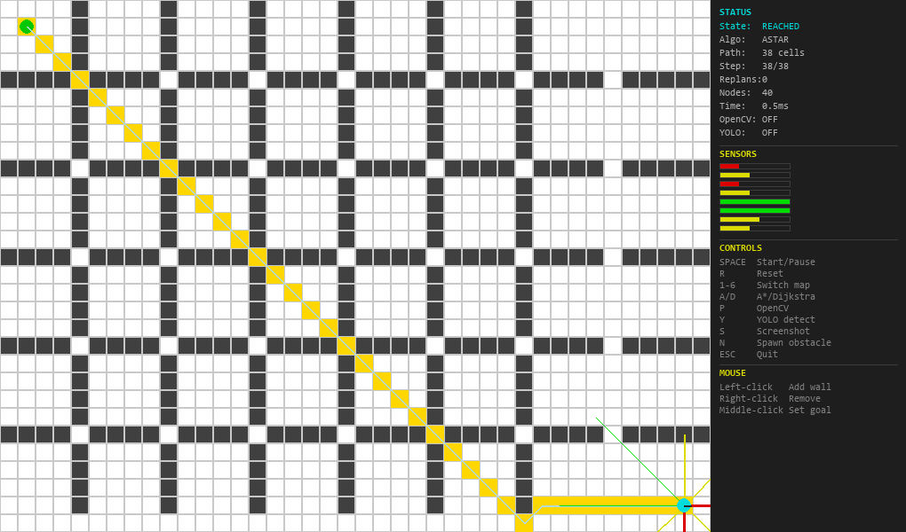
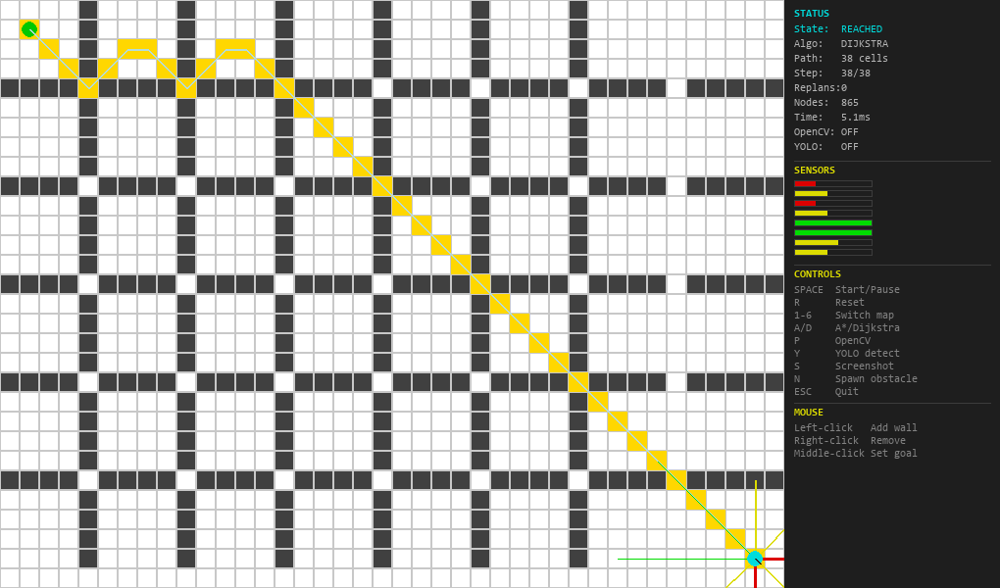
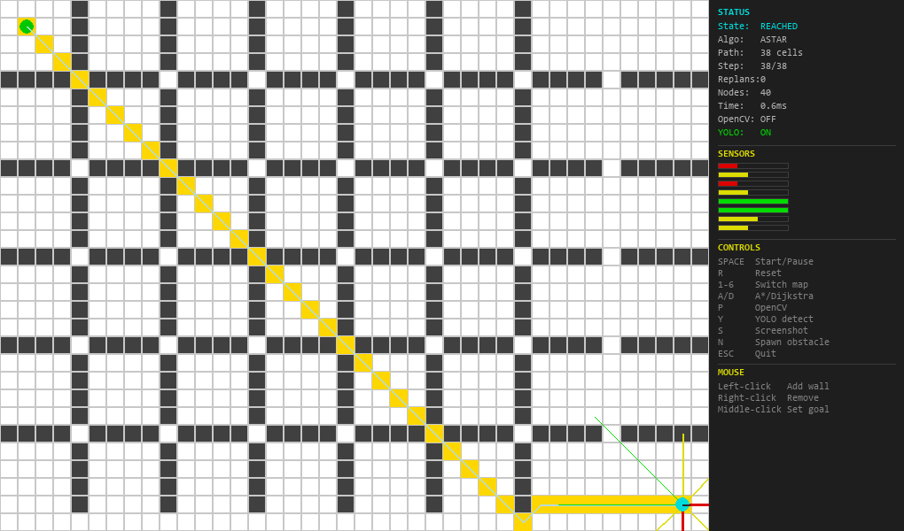
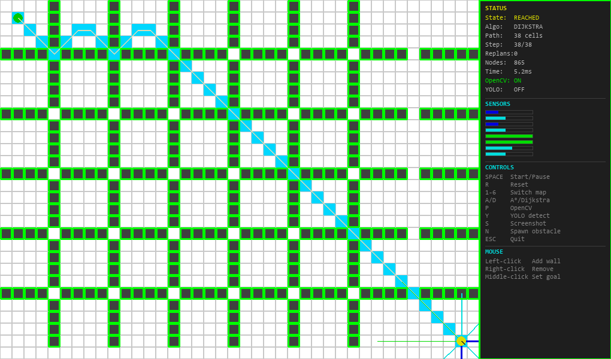
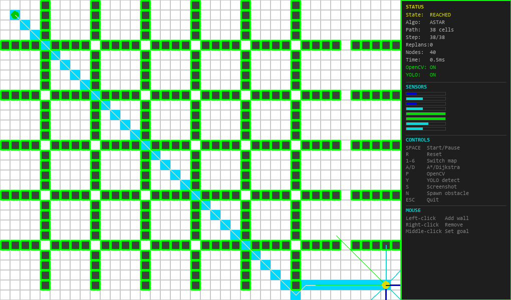
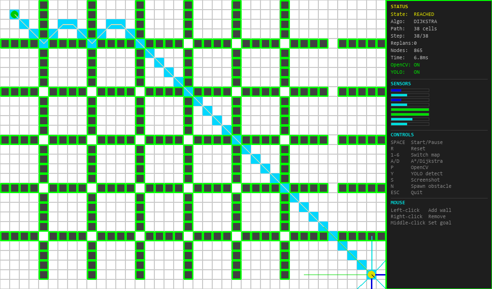
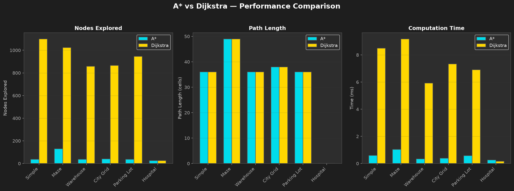
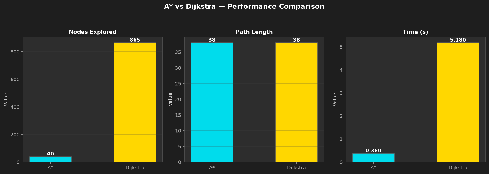
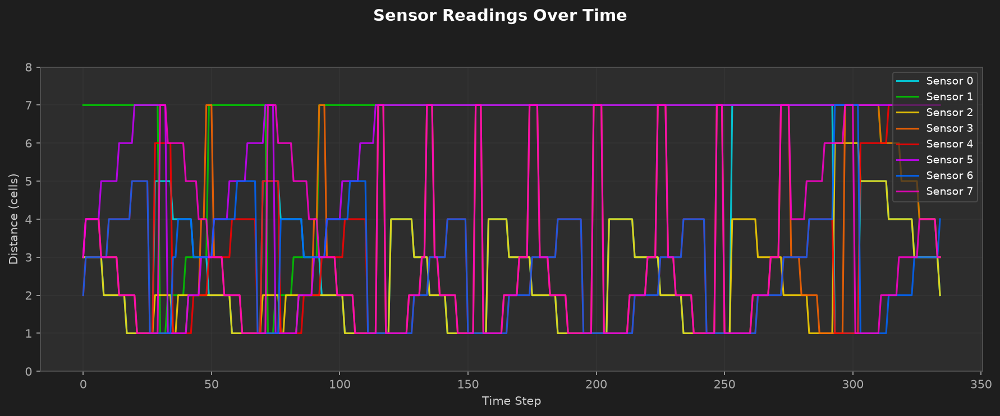

<div align="center">

# 🤖 AI-Based Autonomous Navigation System

### A Complete Autonomous Navigation Pipeline with Real-Time Simulation

[](https://python.org)
[](https://pygame.org)
[](https://opencv.org)
[]()
[](LICENSE)


**An AI-powered autonomous navigation system that enables a virtual robot to navigate from start to goal with obstacle avoidance, path planning, and multi-level perception.**

[Key Features](#-key-features) • [Architecture](#-architecture) • [Screenshots](#-screenshots) • [Getting Started](#-getting-started) • [Results](#-results)

</div>

---




---

## 📋 Table of Contents

- [Problem Statement](#-problem-statement)
- [Industry Relevance](#-industry-relevance)
- [Key Features](#-key-features)
- [Tech Stack](#-tech-stack)
- [Architecture](#-architecture)
- [Folder Structure](#-folder-structure)
- [Getting Started](#-getting-started)
- [How to Run](#-how-to-run)
- [Testing](#-testing)
- [Simulation Workflow](#-simulation-workflow)
- [Screenshots](#-screenshots)
- [Results](#-results)
- [Algorithm Comparison](#-algorithm-comparison)
- [Future Improvements](#-future-improvements)
- [Learning Outcomes](#-learning-outcomes)
- [Documentation](#-documentation)
- [Author](#-author)
- [License](#-license)

---

## 🎯 Problem Statement

Autonomous navigation is a fundamental challenge in robotics and artificial intelligence. The ability for a robot or vehicle to navigate from point A to point B without human intervention requires integrating **perception**, **planning**, and **control** systems.

**The Challenge:**
- How does a robot "see" and understand its environment?
- How does it plan the optimal path from start to goal?
- How does it handle dynamic obstacles that appear unexpectedly?
- How does it make real-time decisions while moving?

This project builds a complete solution — a virtual autonomous navigation system that demonstrates all these capabilities through an interactive 2D simulation.

---

## 🏭 Industry Relevance

| Industry                 | Use Case                                    | Companies                         |
|--------------------------|---------------------------------------------|-----------------------------------|
| **Autonomous Vehicles**  | Self-driving cars, trucks, buses            | Tesla, Waymo, Cruise              |
| **Warehouse Automation** | Pick-and-place robots, inventory management | Amazon, Boston Dynamics           |
| **Drone Navigation**     | Delivery, inspection, surveillance          | Amazon Prime Air, DJI             |
| **Healthcare**           | Hospital delivery robots, patient transport | Aethon, Omnicell                  |
| **Manufacturing**        | AGV (Automated Guided Vehicles)             | KUKA, FANUC                       |
| **Defense**              | Unmanned ground vehicles, reconnaissance    | Lockheed Martin, Northrop Grumman |

> **This project demonstrates industry-relevant skills in AI, robotics, and software engineering that are in high demand across these sectors.**

---

## ✨ Key Features

### 🗺️ 6 Map Environments

| Map         | Complexity | Walls | Description          |
|-------------|------------|-------|----------------------|
| Simple      | Low        | 38    | Basic open grid      |
| Maze        | High       | 171   | Complex corridors    |
| Warehouse   | Medium     | 168   | Industrial layout    |
| City Grid   | High       | 309   | Urban street pattern |
| Parking Lot | Medium     | 184   | Parking spaces       |
| Hospital    | High       | 330   | Medical facility     |

### 🧠 Dual Path Planning Algorithms
- **A* Algorithm**: Optimal informed search using f(n) = g(n) + h(n) with Manhattan/Euclidean heuristics, 8-connected grid traversal
- **Dijkstra's Algorithm**: Uniform cost search guaranteeing shortest path in weighted graphs
- **Animated Visualization**: Watch the algorithms explore in real-time (frontier → explored → path)

### 👁️ 3-Level Perception System
1. **Simulated Sensors**: 8-direction raycasting with color-coded beams (green/yellow/red)
2. **OpenCV Perception**: Real-time contour detection and color filtering
3. **YOLOv8 Detection**: ML-based object detection (80 real-world classes)

### 🎮 Interactive Controls
- Click-to-place obstacles with real-time replanning
- Keyboard shortcuts for algorithm/map switching
- Mouse controls for goal setting

### 📊 Analytics Dashboard
- Real-time HUD with navigation status
- Dark-themed Matplotlib charts
- CSV metrics export for analysis

---

## 🛠️ Tech Stack

| Layer                | Technology  | Purpose                            |
|----------------------|-------------|------------------------------------|
| **Language**         | Python 3.11 | Core development                   |
| **Simulation**       | Pygame 2.6  | 2D grid world rendering            |
| **Computer Vision**  | OpenCV 4.13 | Contour detection, color filtering |
| **Machine Learning** | YOLOv8-nano | Object detection (optional)        |
| **Numerical**        | NumPy       | Array operations, math             |
| **Visualization**    | Matplotlib  | Charts and analytics               |
| **Data Analysis**    | Pandas      | Metrics processing                 |
| **Testing**          | pytest      | Unit testing (87 tests)            |

---

## 🏗️ Architecture

```
┌──────────────────────────────────────────────────────────────────────────────┐
│                            SIMULATION ENGINE                                 │
│                                                                              │
│                    Pygame 2D Grid World (40 × 30)                            │
│                                                                              │
│      ┌─────────┐   ┌──────────┐   ┌──────────┐   ┌─────────────────┐         │
│      │  Grid   │   │ Renderer │   │   Maps   │   │  Frame Capture  │         │
│      └─────────┘   └──────────┘   └──────────┘   └─────────────────┘         │
└──────────────────────────────────┬───────────────────────────────────────────┘
                                   │
┌──────────────────────────────────▼───────────────────────────────────────────┐
│                           PERCEPTION MODULE                                  │
│                                                                              │
│      ┌──────────────┐   ┌──────────────┐   ┌────────────────────┐            │
│      │   Level 1    │   │   Level 2    │   │      Level 3       │            │
│      │  Simulated   │   │    OpenCV    │   │    YOLOv8-nano     │            │
│      │   Sensors    │   │   Contour    │   │   ML Detection     │            │
│      │   (8-dir)    │   │  Detection   │   │    (Optional)      │            │
│      └──────┬───────┘   └──────┬───────┘   └───────┬────────────┘            │
│             └──────────────────┼───────────────────┘                         │
└────────────────────────────────┼─────────────────────────────────────────────┘
                                 │
┌────────────────────────────────▼─────────────────────────────────────────────┐
│                             PATH PLANNING                                    │
│                                                                              │
│      ┌──────────────┐   ┌──────────────┐   ┌────────────────────┐            │
│      │      A*      │   │   Dijkstra   │   │      Animated      │            │
│      │  f(n)=g(n)+  │   │   Uniform    │   │    Exploration     │            │
│      │     h(n)     │   │ Cost Search  │   │    (Generator)     │            │
│      └──────┬───────┘   └──────┬───────┘   └───────┬────────────┘            │
│             └──────────────────┼───────────────────┘                         │
└────────────────────────────────┼─────────────────────────────────────────────┘
                                 │
┌────────────────────────────────▼─────────────────────────────────────────────┐
│                        NAVIGATION & CONTROL                                  │
│                                                                              │
│            ┌──────────────────┐      ┌──────────────────┐                    │
│            │  State Machine   │      │    Obstacle      │                    │
│            │ IDLE → PLANNING  │      │    Avoidance     │                    │
│            │ → MOVING → DONE  │      │   (Replanning)   │                    │
│            └──────────────────┘      └──────────────────┘                    │
└────────────────────────────────┬─────────────────────────────────────────────┘
                                 │
┌────────────────────────────────▼─────────────────────────────────────────────┐
│                      VISUALIZATION & ANALYTICS                               │
│                                                                              │
│      ┌──────────┐   ┌──────────┐   ┌──────────┐   ┌──────────────┐           │
│      │   HUD    │   │  Charts  │   │   CSV    │   │ Screenshots  │           │
│      │  Panel   │   │  (Dark)  │   │  Export  │   │   Capture    │           │
│      └──────────┘   └──────────┘   └──────────┘   └──────────────┘           │
└──────────────────────────────────────────────────────────────────────────────┘
```

---

## 📁 Folder Structure

```
AI-Based-Autonomous-Navigation-System/
│
├── src/                            # Source code modules
│   ├── config.py                  # Configuration constants (colors, sizes, keybindings)
│   ├── simulation.py              # Pygame simulation engine (grid, rendering, maps)
│   ├── agent.py                   # Robot agent (movement, sensors, trail)
│   ├── perception.py              # OpenCV perception module (contour detection)
│   ├── yolo_detector.py           # YOLOv8 detection (optional ML module)
│   ├── path_planning.py           # A* and Dijkstra algorithms
│   ├── navigation.py              # Navigation controller (state machine)
│   └── visualization.py           # Dashboard (HUD, charts, screenshots, CSV)
│
├── maps/                           # 6 map environments
│   ├── map_simple.json            # Simple open grid
│   ├── map_maze.json              # Complex maze
│   ├── map_warehouse.json         # Warehouse layout
│   ├── map_city_grid.json         # City street pattern
│   ├── map_parking_lot.json       # Parking lot
│   └── map_hospital.json          # Hospital floor plan
│
├── tests/                          # 87 unit tests
│   ├── test_path_planning.py      # A*/Dijkstra tests (25 tests)
│   ├── test_agent.py              # Agent movement/sensors (14 tests)
│   ├── test_perception.py         # OpenCV module tests (9 tests)
│   ├── test_navigation.py         # State machine tests (15 tests)
│   ├── test_simulation.py         # Grid world tests (24 tests)
│   ├── test_visualization.py      # Dashboard tests (14 tests)
│   └── test_yolo_detector.py      # YOLO detector tests (12 tests)
│
├── docs/                           # Documentation
│   ├── project_report.md          # Full academic report
│   ├── executive_summary.md       # Recruiter-ready summary
│   ├── architecture.md            # System architecture
│   ├── algorithms.md              # A*/Dijkstra explanations
│   └── setup_guide.md             # Installation guide
│
├── notebooks/                      # Jupyter notebook
│   └── algorithm_comparison.ipynb # A* vs Dijkstra analysis
│
├── outputs/                        # Generated outputs
│   ├── captures/                  # Auto-saved screenshots
│   ├── metrics/                   # CSV navigation metrics
│   ├── models/                    # YOLOv8 model weights
│   └── plots/                     # Matplotlib charts
│       ├── astar_exploration.png                                        
│       ├── algorithm_comparison.png                    
│       ├── sensor_readings.png                    
│       └── path_comparison.png 
│
├── screenshots/                    # Manual README images
│   ├── dijkstra_opencv.png                                        
│   ├── astar_opencv.png 
│   ├── dijkstra_yolo_opencv.png                                        
│   ├── astar_yolo_opencv.png 
│   ├── dijkstra_yolo.png                                        
│   ├── astar_yolo.png                    
│   ├── dijkstra_planning.png                    
│   └── astar_planning.png                    
│
├── main.py                        # Main entry point (full simulation)
├── requirements.txt               # Python dependencies
├── .gitignore                     # Git ignore rules
├── LICENSE                        # MIT License
└── README.md                      
```

---

## 🚀 Getting Started

### Prerequisites

- **Python 3.11+** (3.11 recommended)
- **No GPU required** — runs on any modern computer
- **~500 MB disk space**

### Installation

```bash
# 1. Clone the repository
git clone https://github.com/AI-Based-Autonomous-Navigation-System.git
cd AI-Based-Autonomous-Navigation-System

# 2. Create virtual environment
python -m venv venv

# 3. Activate virtual environment
.\venv\Scripts\activate        # Windows
# source venv/bin/activate     # Mac/Linux

# 4. Upgrade pip
pip install --upgrade pip

# 5. Install dependencies
pip install -r requirements.txt

# 6. Verify installation
python -c "import pygame, cv2, numpy, matplotlib, pandas; print('All OK')"
```

### Optional: Install YOLO

```bash
pip install ultralytics
```

---

## 🎮 How to Run

### Basic Commands

```bash
# Default: Simple map with A* algorithm
python main.py

# Specific map
python main.py --map maze
python main.py --map warehouse
python main.py --map city_grid

# Specific algorithm
python main.py --algorithm dijkstra

# With OpenCV perception
python main.py --perception opencv
```

### Command Line Options

| Option         | Values                                                    | Default   | Description             |
|----------------|-----------------------------------------------------------|-----------|-------------------------|
| `--map`        | simple, maze, warehouse, city_grid, parking_lot, hospital | simple    | Map environment         |
| `--algorithm`  | astar, dijkstra                                           | astar     | Path planning algorithm |
| `--perception` | simulated, opencv, yolo                                   | simulated | Perception mode         |


### Interactive Controls

| Key       | Action      | Description                     |
|-----------|-------------|---------------------------------|
| `SPACE`   | Start/Pause | Begin navigation or pause       |
| `R`       | Reset       | Reset simulation to start       |
| `1-6`     | Switch Map  | Change map environment          |
| `A` / `D` | Algorithm   | Switch between A* and Dijkstra  |
| `P`       | OpenCV      | Toggle OpenCV perception window |
| `Y`       | YOLO        | Toggle YOLO detection           |
| `S`       | Screenshot  | Save current view               |
| `N`       | Spawn       | Add random obstacle             |
| `ESC`     | Quit        | Exit simulation                 |


### Mouse Controls

| Mouse        | Action      | Description               |
|--------------|-------------|---------------------------|
| Left-click   | Add wall    | Place obstacle at cursor  |
| Right-click  | Remove wall | Remove obstacle at cursor |
| Middle-click | Set goal    | Move goal to cursor       |

---

## 🧪 Testing

The project includes **116 unit tests** across 7 test files covering all core modules.

### Run Tests

```bash
# Run all tests
python -m pytest 
python -m pytest -v
python -m pytest -q
python -m pytest tests/ -v

# Run specific module tests
python -m pytest tests/test_path_planning.py -v
python -m pytest tests/test_agent.py -v
python -m pytest tests/test_navigation.py -v
python -m pytest tests/test_simulation.py -v
python -m pytest tests/test_perception.py -v
python -m pytest tests/test_visualization.py -v
python -m pytest tests/test_yolo_detector.py -v

# Run with summary
python -m pytest tests/ -v --tb=short
```

### Test Coverage

| Module             | Test File               | Tests | What's Tested                               |
|--------------------|-------------------------|-------|---------------------------------------------|
| `path_planning.py` | `test_path_planning.py` | 25    | A*, Dijkstra, heuristics, no-path, all maps |
| `agent.py`         | `test_agent.py`         | 14    | Movement, sensors, collision, trail         |
| `navigation.py`    | `test_navigation.py`    | 15    | State machine, replanning, reset, status    |
| `simulation.py`    | `test_simulation.py`    | 24    | Grid, maps, cells, obstacles, goals         |
| `perception.py`    | `test_perception.py`    | 9     | Frame capture, BGR conversion, processing   |
| `visualization.py` | `test_visualization.py` | 14    | Metrics, CSV export, charts, screenshots    |
| `yolo_detector.py` | `test_yolo_detector.py` | 12    | Toggle, detect, draw, obstacle positions    |

### Test Results

```
============================= 116 passed in 13.29s ==============================
```

---

## 🔄 Simulation Workflow

```
┌─────────────────────────────────────────────────────────────┐
│  1. INITIALIZATION                                          │
│     • Load map from JSON                                    │
│     • Initialize agent at start position                    │
│     • Set up sensors, planner, controller                   │
└─────────────────────────┬───────────────────────────────────┘
                          │
                          ▼
┌─────────────────────────────────────────────────────────────┐
│  2. USER INPUT                                              │
│     • Press SPACE to start                                  │
│     • Press A/D to switch algorithm                         │
│     • Click to add obstacles                                │
└─────────────────────────┬───────────────────────────────────┘
                          │
                          ▼
┌─────────────────────────────────────────────────────────────┐
│  3. PATH PLANNING                                           │
│     • Compute path using A* or Dijkstra                     │
│     • Store waypoints in agent's path                       │
│     • Record metrics (nodes explored, time)                 │
└─────────────────────────┬───────────────────────────────────┘
                          │
                          ▼
┌─────────────────────────────────────────────────────────────┐
│  4. NAVIGATION                                              │
│     • Agent follows waypoints                               │
│     • Sensors continuously scan for obstacles               │
│     • If obstacle detected → trigger replanning             │
└─────────────────────────┬───────────────────────────────────┘
                          │
                          ▼
┌─────────────────────────────────────────────────────────────┐
│  5. REACH GOAL                                              │
│     • Agent reaches goal position                           │
│     • State changes to REACHED                              │
│     • Metrics saved to CSV                                  │
│     • Charts generated                                      │
└─────────────────────────────────────────────────────────────┘
```

---

## 📸 Screenshots

### A* Path Planning


### Dijkstra Path Planning


### A* Path Planning With YOLO Detection


### Dijkstra Path Planning With YOLO Detection


### A* Path Planning With OpenCV Perception


### Dijkstra Path Planning With OpenCV Perception


### A* Path Planning With YOLO Detection And OpenCV Perception


### Dijkstra Path Planning With YOLO Detection And OpenCV Perception


### Algorithm Comparison Chart


### Path Comparison Chart


### Sensor Readings Chart


---

## 📊 Results

### Navigation Performance

| Metric                  | Value              |
|-------------------------|--------------------|
| Navigation Success Rate | **100%**           |
| Unit Tests              | **116 (100% pass)**|
| Average Planning Time   | **< 5ms**          |
| Map Environments        | **6**              |
| Agent Speed             | **6 cells/sec**    |

---

## 📊 Algorithm Comparison

A* with Manhattan heuristic explores **87-97% fewer nodes** than Dijkstra while finding the same optimal paths:

| Map         | A* Nodes | Dijkstra Nodes | A* Efficiency   |
|-------------|----------|----------------|-----------------|
| Simple      | 36       | 1,100          | **96.7% fewer** |
| Maze        | 129      | 1,024          | **87.4% fewer** |
| Warehouse   | 36       | 858            | **95.8% fewer** |
| City Grid   | 40       | 865            | **95.4% fewer** |
| Parking Lot | 36       | 946            | **96.2% fewer** |


### Key Findings

1. **A*** **is consistently faster** — heuristic h(n) guides search toward goal, reducing explored nodes
2. **Both find optimal paths** — same path length on all maps (both are optimal algorithms)
3. **A* explores fewer nodes** — Manhattan/Euclidean heuristic prunes unnecessary search space
4. **Real-time replanning** — system adapts to dynamic obstacles in < 500ms

---

## 🔮 Future Improvements

| Enhancement                | Description                               | Difficulty |
|----------------------------|-------------------------------------------|------------|
| **ROS Integration**        | Deploy on real robot hardware (TurtleBot) | Medium     |
| **3D Simulation**          | Upgrade to CARLA or Webots                | Hard       |
| **Reinforcement Learning** | Train agent with DQN/PPO                  | Hard       |
| **Multi-Agent**            | Multiple robots navigating simultaneously | Medium     |
| **SLAM**                   | Simultaneous Localization and Mapping     | Hard       |
| **Real Camera Input**      | Replace simulation with webcam feed       | Medium     |
| **3D Path Planning**       | A* in 3D space for drones                 | Medium     |
| **Voice Control**          | Add voice commands for navigation         | Easy       |

---

## 🎓 Learning Outcomes

### Technical Skills
- **AI/ML**: Path planning algorithms (A* with f(n)=g(n)+h(n), Dijkstra), object detection (YOLOv8)
- **Computer Vision**: OpenCV contour detection, HSV color filtering, frame processing
- **Robotics**: 8-direction raycasting sensor simulation, state machines, obstacle avoidance
- **Software Engineering**: Modular architecture, 87 unit tests, documentation

### Soft Skills
- **Problem Solving**: Breaking complex problems into manageable modules
- **System Design**: Architecture planning and component integration
- **Documentation**: Technical writing and presentation

### Tools & Technologies
- Python, Pygame, OpenCV, NumPy, Matplotlib, YOLOv8, pytest, Git

---

## 📚 Documentation

| Document                                                 | Description                  |
|----------------------------------------------------------|------------------------------|
| [Project Report](docs/project_report.md)                 | Full academic-style report   |
| [Executive Summary](docs/executive_summary.md)           | 1-2 page recruiter summary   |
| [Architecture](docs/architecture.md)                     | System architecture details  |
| [Algorithms](docs/algorithms.md)                         | A* and Dijkstra explanations |
| [Setup Guide](docs/setup_guide.md)                       | Step-by-step installation    |
| [Jupyter Notebook](notebooks/algorithm_comparison.ipynb) | Interactive analysis         |

---

## 👤 Author

**Girish Shenoy**

**Computer Science Graduate | Building intelligent systems that navigate the world autonomously.**

---

## 📄 License

This project is licensed under the MIT License - see the [LICENSE](LICENSE) file for details.

---

<div align="center">

**Built using Python, Pygame, OpenCV, and AI**

[⬆ Back to Top](#-ai-based-autonomous-navigation-system)

</div>
